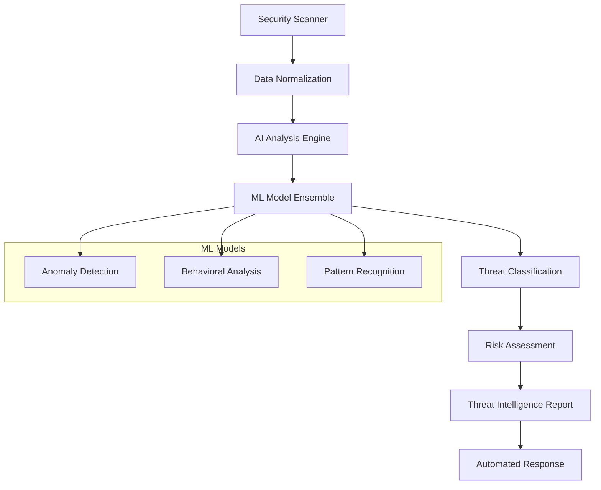
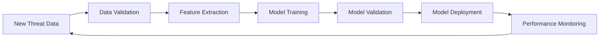
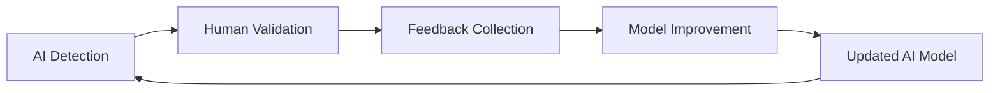
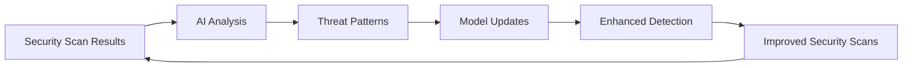

# AI Threat Detection Integration Roadmap

## 🤖 Overview

This document outlines the integration roadmap for the AI Threat Detection Engine with enterprise security platforms, specifically focusing on collaboration with the Enterprise Security Scanner from dark-automation.

## 🔗 Integration Strategy

### Current AI Capabilities

#### AI Threat Detection Engine (uldyssian-sh)
- **Repository**: `uldyssian-sh/necromancer-toolkit`
- **Pull Request**: [#91 - AI Threat Detection Engine Enhancement](https://github.com/necromancer-io/necromancer-toolkit/pull/91)
- **Core Features**:
  - Advanced AI-powered threat detection with multiple ML models
  - Real-time network traffic analysis with pattern recognition
  - Behavioral analysis and anomaly detection for insider threats
  - Comprehensive threat intelligence reporting and analytics

### ML Model Architecture

#### 1. Anomaly Detection Model
```python
{
  "model_type": "isolation_forest",
  "accuracy": 0.94,
  "use_cases": [
    "Network traffic anomalies",
    "Data exfiltration detection",
    "Unusual system behavior"
  ],
  "input_features": [
    "bytes_per_second",
    "connection_count",
    "port_diversity",
    "time_patterns"
  ]
}
```

#### 2. Behavioral Analysis Model
```python
{
  "model_type": "lstm_neural_network",
  "accuracy": 0.91,
  "use_cases": [
    "User behavior analysis",
    "Insider threat detection",
    "APT reconnaissance patterns"
  ],
  "input_features": [
    "login_patterns",
    "access_frequency",
    "data_access_volume",
    "time_of_access"
  ]
}
```

#### 3. Pattern Recognition Model
```python
{
  "model_type": "transformer_model",
  "accuracy": 0.96,
  "use_cases": [
    "Malware communication patterns",
    "Command and control detection",
    "Threat signature matching"
  ],
  "input_features": [
    "user_agent_strings",
    "request_patterns",
    "payload_analysis",
    "communication_frequency"
  ]
}
```

## 🚀 Integration Benefits

### 1. Enhanced Threat Intelligence
- **AI-Powered Analysis**: Apply machine learning to security scan results
- **Predictive Capabilities**: Predict potential threats before they materialize
- **Behavioral Baselines**: Establish normal behavior patterns for better anomaly detection

### 2. Automated Threat Response
- **Intelligent Prioritization**: AI-driven threat severity assessment
- **Contextual Analysis**: Consider multiple data sources for threat assessment
- **Adaptive Learning**: Continuously improve detection based on new data

### 3. Cross-Platform Correlation
- **Multi-Source Intelligence**: Combine static scans with dynamic AI analysis
- **Pattern Recognition**: Identify complex attack patterns across platforms
- **Threat Attribution**: Link related security events across different systems

## 🔧 Technical Integration Architecture

### AI API Endpoints

#### Threat Analysis Endpoint
```http
POST /api/v1/ai/analyze-threats
Content-Type: application/json
Authorization: Bearer <ai_token>

{
  "analysis_type": "comprehensive",
  "data_sources": [
    {
      "type": "security_scan_results",
      "source": "enterprise_security_scanner",
      "data": {...}
    },
    {
      "type": "network_traffic",
      "source": "network_monitor",
      "data": {...}
    }
  ],
  "ml_models": ["anomaly_detection", "behavioral_analysis", "pattern_recognition"],
  "confidence_threshold": 0.75
}
```

#### Behavioral Analysis Endpoint
```http
POST /api/v1/ai/behavioral-analysis
Content-Type: application/json
Authorization: Bearer <ai_token>

{
  "user_id": "user123",
  "time_window": "24h",
  "baseline_data": {...},
  "current_activity": {...},
  "analysis_depth": "deep"
}
```

#### Threat Intelligence Endpoint
```http
GET /api/v1/ai/threat-intelligence
Authorization: Bearer <ai_token>
Query Parameters:
  - threat_types: malware,apt,insider_threat
  - time_range: 7d
  - confidence_min: 0.8
  - format: json|stix
```

### Data Flow Architecture



## 📊 AI Performance Metrics

### Model Performance KPIs
- **Detection Accuracy**: > 95% for known threat patterns
- **False Positive Rate**: < 5% for production deployments
- **Processing Latency**: < 200ms for real-time analysis
- **Model Confidence**: Average confidence score > 0.85

### Integration Performance
- **API Response Time**: < 100ms for threat analysis requests
- **Throughput**: 1,000+ concurrent AI analysis requests
- **Availability**: 99.9% uptime for AI services
- **Scalability**: Auto-scaling based on analysis load

## 🛡️ AI Security Considerations

### Model Security
- **Model Poisoning Protection**: Validate training data integrity
- **Adversarial Attack Resistance**: Robust models against adversarial inputs
- **Model Versioning**: Secure model deployment and rollback capabilities
- **Explainable AI**: Provide reasoning for AI-driven decisions

### Data Privacy
- **Data Minimization**: Process only necessary data for threat detection
- **Anonymization**: Remove PII from AI training and analysis data
- **Secure Processing**: Encrypted data processing in secure enclaves
- **Audit Trails**: Complete logging of AI decision processes

## 🔄 AI Learning Workflows

### 1. Continuous Learning Pipeline


### 2. Feedback Loop Integration


### 3. Cross-Platform Learning


## 📋 Implementation Phases

### Phase 1: AI Foundation (Current)
- [x] AI Threat Detection Engine implementation
- [x] ML model architecture design
- [x] Core threat detection capabilities
- [x] Pull request submitted for review

### Phase 2: Integration Development
- [ ] API endpoint implementation for external integration
- [ ] Data format standardization with security scanners
- [ ] Authentication and authorization framework
- [ ] Performance optimization for real-time processing

### Phase 3: Advanced AI Features
- [ ] Multi-model ensemble learning
- [ ] Predictive threat modeling
- [ ] Automated model retraining
- [ ] Explainable AI implementation

### Phase 4: Production Deployment
- [ ] Production-ready AI infrastructure
- [ ] Monitoring and alerting for AI systems
- [ ] Model governance and compliance
- [ ] Continuous improvement processes

## 🤝 Collaboration Framework

### Cross-Platform Development
- **Shared Standards**: Common data formats and API specifications
- **Joint Testing**: Integrated testing across both platforms
- **Knowledge Sharing**: Regular technical discussions and reviews
- **Quality Assurance**: Mutual code review and security audits

### AI Model Collaboration
- **Model Sharing**: Share trained models for specific use cases
- **Joint Training**: Collaborative model training on combined datasets
- **Performance Benchmarking**: Standardized evaluation metrics
- **Research Collaboration**: Joint research on new AI techniques

## 🔮 Future AI Enhancements

### Advanced AI Capabilities
- **Deep Learning Models**: Advanced neural networks for complex threat detection
- **Reinforcement Learning**: Self-improving threat response systems
- **Natural Language Processing**: Analysis of threat intelligence reports
- **Computer Vision**: Visual analysis of network topology and security diagrams

### Emerging Technologies
- **Quantum Machine Learning**: Quantum-enhanced threat detection algorithms
- **Federated Learning**: Distributed AI training across multiple organizations
- **Edge AI**: AI processing at network edge for real-time threat detection
- **Neuromorphic Computing**: Brain-inspired computing for efficient AI processing

## 📈 Success Metrics

### AI Effectiveness
- **Threat Detection Rate**: Percentage of actual threats detected
- **Time to Detection**: Average time from threat occurrence to detection
- **Threat Classification Accuracy**: Correct categorization of threat types
- **Predictive Accuracy**: Success rate of predictive threat modeling

### Business Impact
- **Security Incident Reduction**: Decrease in successful security incidents
- **Response Time Improvement**: Faster incident response through AI automation
- **Cost Optimization**: Reduced security operations costs through automation
- **Compliance Enhancement**: Improved compliance posture through AI monitoring

---

**AI Research Lead**: uldyssian-sh  
**Integration Partner**: necromancer-io  
**Last Updated**: 2025-01-02  
**Version**: 1.0.0