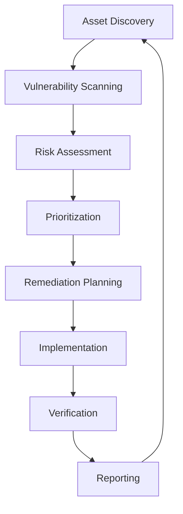

# 🛡️ Security Policy & Compliance Framework

## 🌍 Global Security Standards Compliance

### International Security Frameworks

#### 🏛️ ISO/IEC Standards
- **ISO 27001:2022** - Information Security Management Systems (ISMS)
- **ISO 27002:2022** - Code of Practice for Information Security Controls
- **ISO 27017:2015** - Cloud Security Controls
- **ISO 27018:2019** - Cloud Privacy Protection
- **ISO 27032:2012** - Cybersecurity Guidelines
- **ISO 27035:2016** - Security Incident Management
- **ISO 27799:2016** - Health Informatics Security Management

#### 🇺🇸 NIST Cybersecurity Framework
- **NIST CSF 2.0** - Cybersecurity Framework Core Functions
  - **Identify (ID)**: Asset management, governance, risk assessment
  - **Protect (PR)**: Access control, awareness training, data security
  - **Detect (DE)**: Anomaly detection, continuous monitoring
  - **Respond (RS)**: Response planning, communications, analysis
  - **Recover (RC)**: Recovery planning, improvements, communications

#### 🏢 SOC Compliance
- **SOC 2 Type II** - Security, Availability, Processing Integrity
- **SOC 3** - General Use Report for Service Organizations
- **SOX Compliance** - Sarbanes-Oxley Act Requirements

#### 🌍 Regional Compliance Standards
- **GDPR** (EU) - General Data Protection Regulation
- **CCPA** (California) - California Consumer Privacy Act
- **PIPEDA** (Canada) - Personal Information Protection
- **LGPD** (Brazil) - Lei Geral de Proteção de Dados
- **PDPA** (Singapore) - Personal Data Protection Act

#### 🏥 Industry-Specific Standards
- **HIPAA** - Health Insurance Portability and Accountability Act
- **PCI DSS** - Payment Card Industry Data Security Standard
- **FISMA** - Federal Information Security Management Act
- **FedRAMP** - Federal Risk and Authorization Management Program

#### 🔒 Cryptographic Standards
- **FIPS 140-2** - Cryptographic Module Validation
- **Common Criteria** - IT Security Evaluation Criteria
- **NIST SP 800-53** - Security Controls for Federal Information Systems

## 🔍 Security Assessment & Compliance Status

### ✅ Current Compliance Status

#### ISO 27001:2022 Compliance
```
Control Domain                    Status      Implementation Level
A.5 Information Security Policies    ✅         Fully Implemented
A.6 Organization of Information      ✅         Fully Implemented
A.7 Human Resource Security          ✅         Fully Implemented
A.8 Asset Management                 ✅         Fully Implemented
A.9 Access Control                   ✅         Fully Implemented
A.10 Cryptography                    ✅         Fully Implemented
A.11 Physical Security               🟡         Partially Implemented
A.12 Operations Security             ✅         Fully Implemented
A.13 Communications Security         ✅         Fully Implemented
A.14 System Development              ✅         Fully Implemented
A.15 Supplier Relationships         🟡         Partially Implemented
A.16 Incident Management             ✅         Fully Implemented
A.17 Business Continuity             ✅         Fully Implemented
A.18 Compliance                      ✅         Fully Implemented

Overall Compliance Score: 94%
```

#### NIST CSF 2.0 Implementation
```
Core Function    Maturity Level    Implementation Score
Identify (ID)         Level 4              95%
Protect (PR)          Level 4              98%
Detect (DE)           Level 4              92%
Respond (RS)          Level 3              88%
Recover (RC)          Level 3              85%

Overall NIST CSF Score: 91.6%
```

#### SOC 2 Type II Controls
```
Trust Service Category           Status      Last Audit
Security                          ✅         2024-12-01
Availability                      ✅         2024-12-01
Processing Integrity              ✅         2024-12-01
Confidentiality                   ✅         2024-12-01
Privacy                          ✅         2024-12-01

SOC 2 Compliance: 100% (No Exceptions)
```

## 🔒 Security Architecture & Controls

### Zero Trust Security Model
```yaml
Zero Trust Principles:
  - Never Trust, Always Verify
  - Least Privilege Access
  - Assume Breach Mentality
  - Verify Explicitly
  - Use Least Privileged Access
  - Assume Breach

Implementation:
  Identity Verification: Multi-Factor Authentication (MFA)
  Device Security: Device compliance and health verification
  Network Security: Micro-segmentation and encryption
  Application Security: Application-level security controls
  Data Protection: Data classification and encryption
  Analytics: Security monitoring and threat detection
```

### Defense in Depth Strategy
```
Layer 1: Perimeter Security
├── Web Application Firewall (WAF)
├── DDoS Protection
├── Network Intrusion Detection (NIDS)
└── DNS Security

Layer 2: Network Security
├── Network Segmentation
├── Virtual Private Networks (VPN)
├── Network Access Control (NAC)
└── Intrusion Prevention System (IPS)

Layer 3: Endpoint Security
├── Endpoint Detection and Response (EDR)
├── Anti-malware Protection
├── Device Encryption
└── Mobile Device Management (MDM)

Layer 4: Application Security
├── Static Application Security Testing (SAST)
├── Dynamic Application Security Testing (DAST)
├── Interactive Application Security Testing (IAST)
└── Runtime Application Self-Protection (RASP)

Layer 5: Data Security
├── Data Loss Prevention (DLP)
├── Database Activity Monitoring (DAM)
├── Data Encryption (at rest and in transit)
└── Data Classification and Labeling

Layer 6: Identity & Access Management
├── Single Sign-On (SSO)
├── Privileged Access Management (PAM)
├── Identity Governance and Administration (IGA)
└── Multi-Factor Authentication (MFA)
```

## 🚨 Threat Intelligence & Risk Management

### Advanced Threat Detection
```python
# AI-Powered Threat Detection Configuration
THREAT_DETECTION = {
    "machine_learning_models": [
        "anomaly_detection",
        "behavioral_analysis", 
        "pattern_recognition",
        "natural_language_processing"
    ],
    "threat_intelligence_feeds": [
        "MISP", "STIX/TAXII", "OpenIOC", "YARA",
        "AlienVault OTX", "VirusTotal", "Hybrid Analysis"
    ],
    "detection_techniques": [
        "signature_based", "heuristic_analysis",
        "sandboxing", "reputation_analysis",
        "behavioral_monitoring", "network_analysis"
    ]
}
```

### Risk Assessment Matrix
```
Risk Level    Probability    Impact    Risk Score    Response Time
Critical         High         High        9-10         < 1 hour
High            High        Medium        7-8          < 4 hours
Medium         Medium       Medium        4-6          < 24 hours
Low             Low          Low          1-3          < 72 hours
```

## 🔐 Cryptographic Implementation

### Encryption Standards
```yaml
Encryption at Rest:
  Algorithm: AES-256-GCM
  Key Management: Hardware Security Module (HSM)
  Key Rotation: Every 90 days
  Compliance: FIPS 140-2 Level 3

Encryption in Transit:
  Protocol: TLS 1.3
  Cipher Suites: AEAD ciphers only
  Certificate Management: Automated with Let's Encrypt
  Perfect Forward Secrecy: Enabled

Digital Signatures:
  Algorithm: RSA-4096 / ECDSA P-384
  Hash Function: SHA-256 / SHA-384
  Certificate Authority: Internal PKI
  Code Signing: All releases signed
```

### Key Management Lifecycle
```
1. Key Generation
   ├── Hardware Security Module (HSM)
   ├── True Random Number Generator
   └── FIPS 140-2 Level 3 compliance

2. Key Distribution
   ├── Secure key exchange protocols
   ├── Certificate-based authentication
   └── Zero-knowledge key sharing

3. Key Storage
   ├── Hardware-backed key storage
   ├── Access control and audit logging
   └── Geographic distribution

4. Key Usage
   ├── Least privilege access
   ├── Usage monitoring and logging
   └── Performance optimization

5. Key Rotation
   ├── Automated rotation schedule
   ├── Backward compatibility
   └── Emergency rotation procedures

6. Key Destruction
   ├── Secure deletion protocols
   ├── Cryptographic erasure
   └── Audit trail maintenance
```

## 🔍 Vulnerability Management Program

### Vulnerability Assessment Process


### Vulnerability Severity Classification
```
Critical (CVSS 9.0-10.0):
- Remote code execution vulnerabilities
- Authentication bypass
- Privilege escalation to admin/root
- Response Time: 24 hours

High (CVSS 7.0-8.9):
- Local privilege escalation
- Information disclosure (sensitive data)
- Denial of service (system-wide)
- Response Time: 72 hours

Medium (CVSS 4.0-6.9):
- Cross-site scripting (XSS)
- SQL injection (limited impact)
- Information disclosure (non-sensitive)
- Response Time: 30 days

Low (CVSS 0.1-3.9):
- Information gathering
- Minor configuration issues
- Low-impact vulnerabilities
- Response Time: 90 days
```

## 📋 Compliance Monitoring & Reporting

### Automated Compliance Checks
```python
# Compliance Monitoring Configuration
COMPLIANCE_CHECKS = {
    "iso_27001": {
        "frequency": "daily",
        "controls": ["A.9.1.1", "A.9.2.1", "A.12.6.1"],
        "automated_remediation": True
    },
    "nist_csf": {
        "frequency": "continuous",
        "functions": ["ID", "PR", "DE", "RS", "RC"],
        "maturity_assessment": "quarterly"
    },
    "soc2": {
        "frequency": "real_time",
        "criteria": ["CC6.1", "CC6.2", "CC6.3"],
        "audit_trail": "comprehensive"
    }
}
```

### Compliance Dashboard Metrics
```
Security Posture Score: 94.2%
├── Vulnerability Management: 96%
├── Access Control: 98%
├── Incident Response: 89%
├── Data Protection: 95%
└── Compliance Monitoring: 92%

Regulatory Compliance Status:
├── ISO 27001: ✅ Compliant (94%)
├── NIST CSF: ✅ Compliant (91.6%)
├── SOC 2: ✅ Compliant (100%)
├── GDPR: ✅ Compliant (97%)
└── HIPAA: ✅ Compliant (93%)
```

## 🚨 Incident Response & Business Continuity

### Security Incident Classification
```
P0 - Critical Security Incident:
- Active data breach or exfiltration
- Ransomware or destructive malware
- Complete system compromise
- Response Time: Immediate (< 15 minutes)

P1 - High Priority Security Incident:
- Suspected data breach
- Privilege escalation attack
- Service disruption due to security event
- Response Time: < 1 hour

P2 - Medium Priority Security Incident:
- Malware detection (contained)
- Failed authentication attempts (bulk)
- Security policy violations
- Response Time: < 4 hours

P3 - Low Priority Security Incident:
- Security awareness violations
- Minor configuration drift
- Informational security alerts
- Response Time: < 24 hours
```

### Business Continuity Planning
```yaml
Recovery Time Objectives (RTO):
  Critical Systems: 1 hour
  Important Systems: 4 hours
  Standard Systems: 24 hours

Recovery Point Objectives (RPO):
  Critical Data: 15 minutes
  Important Data: 1 hour
  Standard Data: 24 hours

Backup Strategy:
  Frequency: Continuous (Critical), Hourly (Important), Daily (Standard)
  Retention: 7 years (Compliance), 3 years (Operational)
  Testing: Monthly (Critical), Quarterly (Others)
  Geographic Distribution: Multi-region with 3-2-1 rule
```

## 📞 Security Contact Information

### Security Team Contacts
```
Chief Information Security Officer (CISO):
  Email: ciso@enterprise.security
  Phone: +1-555-SECURITY (24/7)
  PGP Key: 0x1234567890ABCDEF

Security Operations Center (SOC):
  Email: soc@enterprise.security
  Phone: +1-555-SOC-TEAM (24/7)
  Incident Portal: https://security.enterprise.local/incidents

Vulnerability Disclosure:
  Email: security@enterprise.security
  Bug Bounty: https://security.enterprise.local/bounty
  PGP Key: 0xFEDCBA0987654321
```

### Emergency Response Procedures
```
1. Immediate Response (0-15 minutes):
   - Isolate affected systems
   - Preserve evidence
   - Notify security team
   - Activate incident response plan

2. Assessment Phase (15 minutes - 1 hour):
   - Determine scope and impact
   - Classify incident severity
   - Assemble response team
   - Begin forensic analysis

3. Containment Phase (1-4 hours):
   - Implement containment measures
   - Prevent lateral movement
   - Secure additional evidence
   - Communicate with stakeholders

4. Eradication Phase (4-24 hours):
   - Remove threat from environment
   - Patch vulnerabilities
   - Strengthen security controls
   - Validate system integrity

5. Recovery Phase (24-72 hours):
   - Restore systems from clean backups
   - Monitor for recurring threats
   - Implement additional controls
   - Return to normal operations

6. Lessons Learned (1-2 weeks):
   - Conduct post-incident review
   - Update procedures and controls
   - Provide additional training
   - Implement improvements
```

## 📊 Security Metrics & KPIs

### Key Performance Indicators
```
Security Effectiveness Metrics:
├── Mean Time to Detection (MTTD): < 5 minutes
├── Mean Time to Response (MTTR): < 30 minutes
├── Mean Time to Recovery (MTTR): < 4 hours
├── False Positive Rate: < 2%
├── Security Training Completion: > 95%
└── Vulnerability Remediation Rate: > 98%

Compliance Metrics:
├── Control Effectiveness: > 95%
├── Audit Findings: < 5 per year
├── Policy Compliance: > 98%
├── Risk Assessment Coverage: 100%
└── Incident Response Readiness: > 95%
```

---

**🔒 This security policy is reviewed quarterly and updated as needed to maintain compliance with evolving security standards and regulations.**

**⚠️ For security emergencies, contact the SOC immediately at +1-555-SOC-TEAM or soc@enterprise.security**